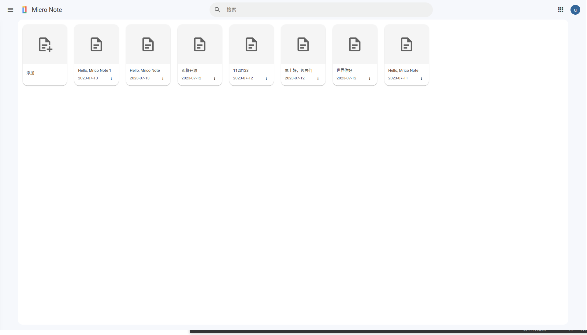
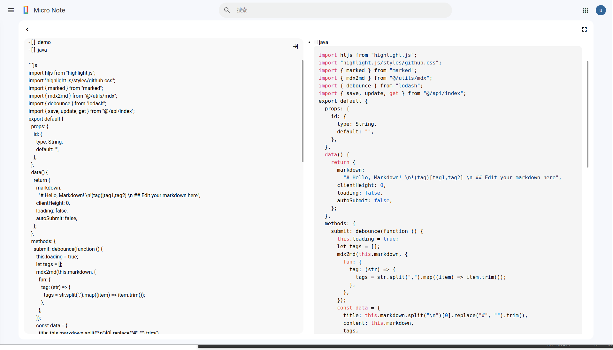

# micro-note

---

support markdown , app run in local

md file save in local

**view**




**run**

```bash
docker run -d -p 3390:3390 -v /home/xxx/micro-note:/workspace/data --name micro-note yangrd/micro-note
```

web bowers open http://localhost:3390